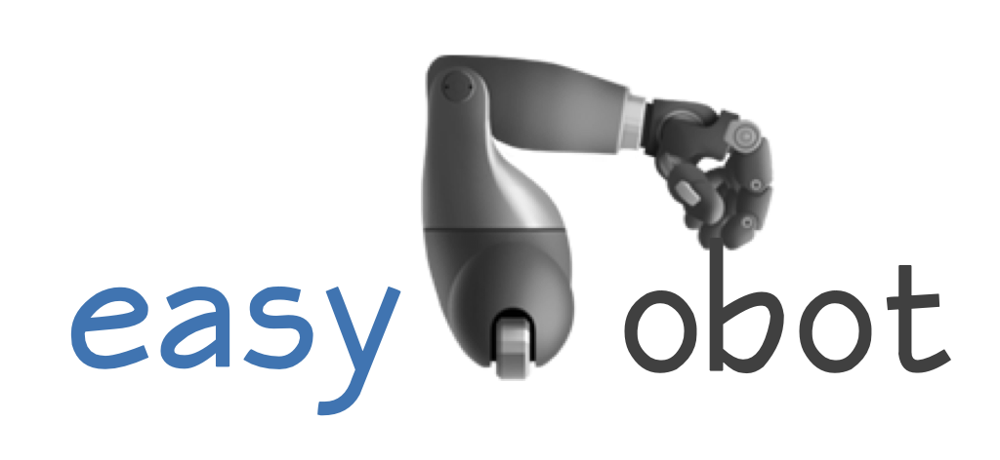

# easyrobot

An easy and unified interface for robots (and grippers, *etc.*).

**Note**. The package is currently under active development.

## Setup

Clone the repository.

```bash
git clone git@github.com:Galaxies99/easyrobot.git
```

Follow the [robot installation manual](docs/install/robot.md) to install the robot dependencies, and follow the [camera installation manual](docs/install/camera.md) to install the camera libraries.

Then, install the `easyrobot` library.

```bash
cd easyrobot
python setup.py install
```

Find `multiprocessing/shared_memory.py` file in the python site-packages folder, then edit the following lines

```python
from .resource_tracker import register
register(self._name, "shared_memory")
```

into

```python
if create:
    from .resource_tracker import register
    register(self._name, "shared_memory")
```

according to the suggestions in [python bug report center](https://bugs.python.org/issue39959).

Finally, `import easyrobot`!

## Supported Devices

- **Robot**(`.robot`). Flexiv Robot.

- **Gripper**(`.gripper`). Robotiq 2F-85, Robotiq 2F-140, Dahuan AG95.

- **Camera**(`.camera`). RealSense D415/D435/L515, etc.

- **Pedal**(`.pedal`). Logitech G29.

- **Sensor**(`.sensor`).
  - **Force/Torque Sensor**(`.sensor.force_torque`). ATI, OptoForce.

## Acknowledgement & Reference

The Flexiv robot interface is built upon the official Flexiv RDK: [https://github.com/flexivrobotics/flexiv_rdk/](https://github.com/flexivrobotics/flexiv_rdk/)
